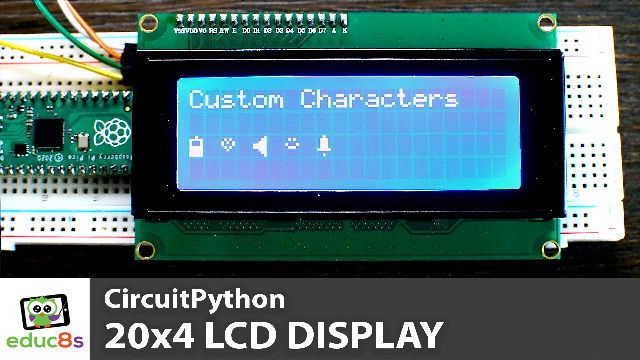

# CircuitPython Character LCD 20x4

CircuitPython Character LCD 20x4 with pcf8574 I2C backpack.

  

🎥 <a href="https://youtu.be/ysH_P1WvidQ">Video Tutorial on YouTube</a>

 
 

| 📺 <a href="https://www.youtube.com/educ8s">YouTube</a>
| 🌍 <a href="http://www.educ8s.tv">Website</a> |  

# Parts needed

🛒 20x4 Character Display ▶ http://educ8s.tv/part/20x4LCD

🛒 Raspberry Pi Pico ▶ http://educ8s.tv/part/RaspberryPiPico

🛒 Wires ▶ http://educ8s.tv/part/Wires

💖 Full disclosure: All of the links above are affiliate links. I get a small percentage of each sale they generate. Thank you for your support!
